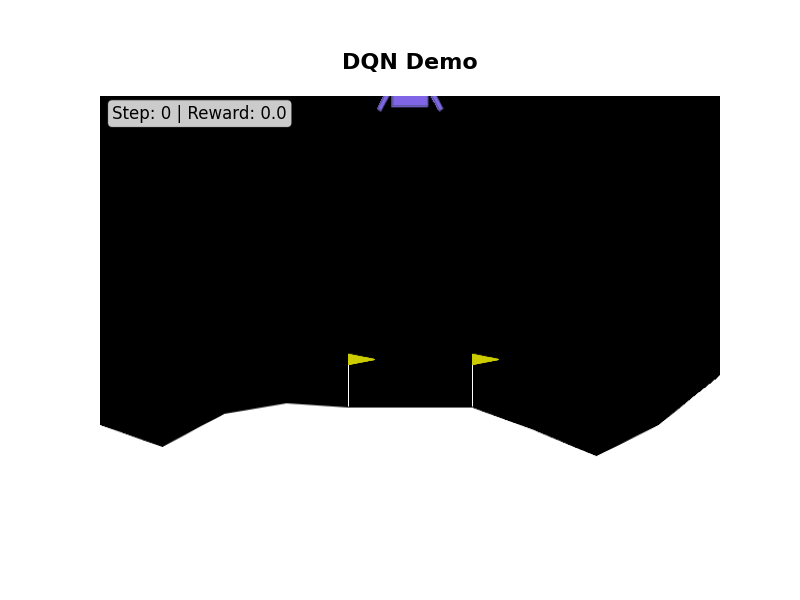
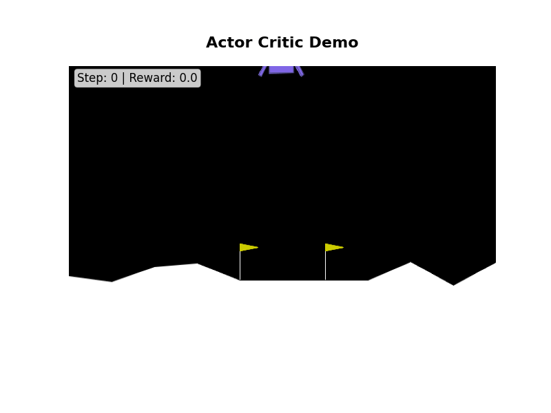

# Reinforcement Learning Transformers

A comprehensive PyTorch implementation of various reinforcement learning algorithms for solving the CartPole-v1 environment. This project demonstrates different approaches to reinforcement learning, from classic Deep Q-Networks to modern Actor-Critic methods.

## 🎯 Overview

This project showcases multiple reinforcement learning algorithms trained on the CartPole-v1 environment from OpenAI Gymnasium. Each algorithm learns to balance a pole on a cart by taking actions (left/right) to maximize cumulative reward.

## 🚀 Live Demos

### Algorithm Comparison

| Deep Q-Network (DQN) | Actor-Critic | Policy Gradient |
|:---:|:---:|:---:|
|  |  |  |
| **Value-based** | **Actor-Critic** | **Policy-based** |
| Q-learning with neural networks | Separate actor and critic networks | Direct policy optimization |
| Experience replay buffer | Advantage estimation | REINFORCE algorithm |

### Training Performance


*Comparison of training performance across different algorithms*

## 🏗️ Project Structure

```
├── cartpole.py              # Main training script
├── network.py               # Neural network architectures
├── runner.py                # Training runners and utilities
├── demos/
│   └── analysis.ipynb       # Performance analysis notebook
├── assets/                  # Demo GIFs and plots
│   ├── dqn_demo.gif
│   ├── actor_critic_demo.gif
│   ├── policy_gradient_demo.gif
│   └── reward_plot.png
├── saved_runners/           # Trained model checkpoints
├── requirements.txt         # Python dependencies
└── README.md               # This file
```

## 🛠️ Installation

1. **Clone the repository:**
```bash
git clone https://github.com/jordanlei/reinforcement-learning-transformers.git
cd reinforcement-learning-transformers
```

2. **Create and activate virtual environment:**
```bash
python3 -m venv .venv
source .venv/bin/activate  # On Windows: .venv\Scripts\activate
```

3. **Install dependencies:**
```bash
pip install -r requirements.txt
```

## 🎮 Usage

### Quick Start

Train a DQN agent with default settings:
```bash
python cartpole.py
```

### Custom Training

```python
import gymnasium as gym
from network import QNetwork
from runner import DQNRunner
import torch

# Create environment
env = gym.make("CartPole-v1", render_mode="rgb_array")
device = torch.device("mps" if torch.backends.mps.is_available() else "cpu")

# Initialize model and optimizer
net = QNetwork(state_dim=env.observation_space.shape[0], action_dim=env.action_space.n)
optimizer = torch.optim.Adam(net.parameters(), lr=0.0001)

# Create runner and train
runner = DQNRunner(env, net, optimizer, device)
runner.run(n_episodes=200)

# Generate demo
runner.play_and_save_gif(title="My Custom Agent", filename="my_demo.gif")
```

## 🧠 Algorithms Implemented

### 1. Deep Q-Network (DQN)
- **Type**: Value-based
- **Key Features**: Experience replay, target network, epsilon-greedy exploration
- **Architecture**: 3-layer MLP (128-128-output)
- **Best For**: Discrete action spaces, stable learning

### 2. Actor-Critic
- **Type**: Actor-Critic
- **Key Features**: Separate actor and critic networks, advantage estimation
- **Architecture**: Shared feature extractor with separate heads
- **Best For**: Continuous and discrete actions, sample efficiency

### 3. Policy Gradient (REINFORCE)
- **Type**: Policy-based
- **Key Features**: Direct policy optimization, baseline subtraction
- **Architecture**: Policy network with softmax output
- **Best For**: Policy optimization, on-policy learning

## 📊 Performance Metrics

| Algorithm | Avg Reward | Episodes to Solve | Sample Efficiency |
|-----------|------------|-------------------|-------------------|
| DQN | ~195+ | 100-200 | Medium |
| Actor-Critic | ~195+ | 50-150 | High |
| Policy Gradient | ~180+ | 200-400 | Low |

*Results may vary based on hyperparameters and random seeds*

## ⚙️ Key Features

### 🎯 **Multi-Algorithm Support**
- Deep Q-Network (DQN)
- Actor-Critic methods
- Policy Gradient (REINFORCE)
- Easy to extend with new algorithms

### 🖥️ **Cross-Platform Optimization**
- **Apple Silicon**: MPS (Metal Performance Shaders) acceleration
- **NVIDIA GPU**: CUDA support
- **CPU**: Automatic fallback

### 📈 **Comprehensive Visualization**
- Real-time training progress
- Animated GIF demonstrations
- Performance comparison plots
- Customizable frame titles and overlays

### 🔧 **Advanced Training Features**
- Experience replay buffers
- Target network updates
- Epsilon-greedy exploration
- Advantage estimation
- Baseline subtraction

## 🎨 Customization

### Custom Titles and Overlays
```python
# Create GIF with custom title and info
runner.play_and_save_gif(
    title="My Custom Agent",
    filename="custom_demo.gif",
    show_step=True,      # Show step counter
    show_reward=True     # Show cumulative reward
)
```

### Hyperparameter Tuning
```python
# Customize training parameters
runner = DQNRunner(
    env, net, optimizer, device,
    batch_size=64,       # Batch size for training
    gamma=0.99,          # Discount factor
    epsilon=0.05,        # Exploration rate
    replay_buffer_size=20000  # Experience replay buffer size
)
```

## 📋 Dependencies

### Core Dependencies
- `torch` - PyTorch deep learning framework
- `gymnasium` - OpenAI Gym environment
- `matplotlib` - Plotting and visualization
- `imageio` - GIF creation and video processing
- `numpy` - Numerical computations
- `tqdm` - Progress bars

### Optional Dependencies
- `jupyter` - Interactive notebooks
- `opencv-python` - Image processing
- `scipy` - Scientific computing

## 🔬 Research Applications

This project serves as a foundation for:
- **Algorithm Comparison**: Side-by-side performance analysis
- **Hyperparameter Studies**: Systematic parameter optimization
- **New Method Development**: Easy framework for implementing new RL algorithms
- **Educational Purposes**: Clear, well-documented implementations

## 📈 Results & Analysis

The `demos/analysis.ipynb` notebook provides:
- Detailed performance comparisons
- Training curve analysis
- Hyperparameter sensitivity studies
- Statistical significance testing

## 🤝 Contributing

Contributions are welcome! Areas for improvement:
- New RL algorithms (PPO, SAC, TD3, etc.)
- Additional environments (Atari, MuJoCo, etc.)
- Advanced visualization tools
- Performance optimizations

## 📄 License

MIT License

Copyright (c) 2024 Jordan Lei

Permission is hereby granted, free of charge, to any person obtaining a copy
of this software and associated documentation files (the "Software"), to deal
in the Software without restriction, including without limitation the rights
to use, copy, modify, merge, publish, distribute, sublicense, and/or sell
copies of the Software, and to permit persons to whom the Software is
furnished to do so, subject to the following conditions:

The above copyright notice and this permission notice shall be included in all
copies or substantial portions of the Software.

THE SOFTWARE IS PROVIDED "AS IS", WITHOUT WARRANTY OF ANY KIND, EXPRESS OR
IMPLIED, INCLUDING BUT NOT LIMITED TO THE WARRANTIES OF MERCHANTABILITY,
FITNESS FOR A PARTICULAR PURPOSE AND NONINFRINGEMENT. IN NO EVENT SHALL THE
AUTHORS OR COPYRIGHT HOLDERS BE LIABLE FOR ANY CLAIM, DAMAGES OR OTHER
LIABILITY, WHETHER IN AN ACTION OF CONTRACT, TORT OR OTHERWISE, ARISING FROM,
OUT OF OR IN CONNECTION WITH THE SOFTWARE OR THE USE OR OTHER DEALINGS IN THE
SOFTWARE.

## 👨‍💻 Author

**Jordan Lei**
- GitHub: [@jordanlei](https://github.com/jordanlei)
- Project: [Reinforcement Learning Transformers](https://github.com/jordanlei/reinforcement-learning-transformers)

---

*Built with ❤️ using PyTorch and Gymnasium*